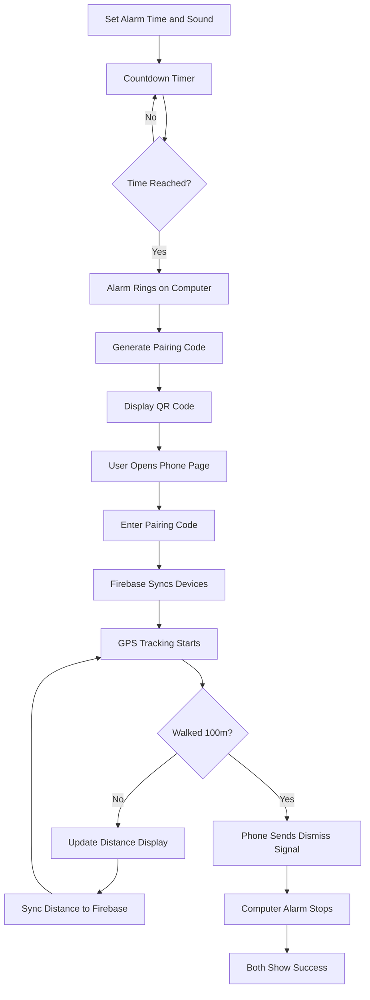
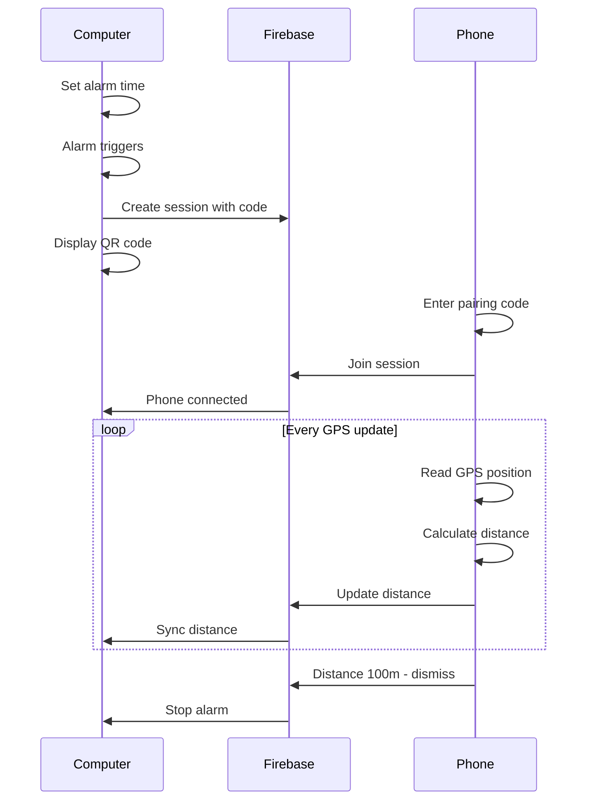
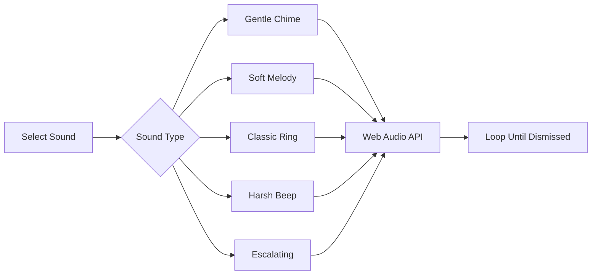

# Walk Alarm — Architecture

## Alarm Flow

```mermaid
flowchart TD
    A[Set Alarm Time and Sound] --> B[Countdown Timer]
    B --> C{Time Reached?}
    C -- No --> B
    C -- Yes --> D[Alarm Rings on Computer]
    D --> E[Generate Pairing Code]
    E --> F[Display QR Code]
    F --> G[User Opens Phone Page]
    G --> H[Enter Pairing Code]
    H --> I[Firebase Syncs Devices]
    I --> J[GPS Tracking Starts]
    J --> K{Walked 100m?}
    K -- No --> L[Update Distance Display]
    L --> M[Sync Distance to Firebase]
    M --> J
    K -- Yes --> N[Phone Sends Dismiss Signal]
    N --> O[Computer Alarm Stops]
    O --> P[Both Show Success]
```

## Device Communication

```mermaid
sequenceDiagram
    participant C as Computer
    participant FB as Firebase
    participant P as Phone

    C->>C: Set alarm time
    C->>C: Alarm triggers
    C->>FB: Create session with code
    C->>C: Display QR code
    P->>P: Enter pairing code
    P->>FB: Join session
    FB->>C: Phone connected

    loop Every GPS update
        P->>P: Read GPS position
        P->>P: Calculate distance
        P->>FB: Update distance
        FB->>C: Sync distance
    end

    P->>FB: Distance 100m - dismiss
    FB->>C: Stop alarm
```

## Sound System

```mermaid
flowchart LR
    A[Select Sound] --> B{Sound Type}
    B --> C[Gentle Chime]
    B --> D[Soft Melody]
    B --> E[Classic Ring]
    B --> F[Harsh Beep]
    B --> G[Escalating]
    C & D & E & F & G --> H[Web Audio API]
    H --> I[Loop Until Dismissed]
```
